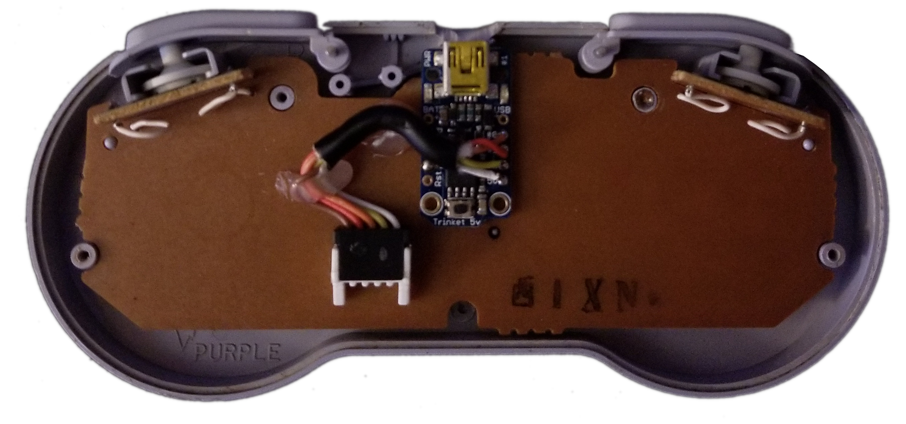

# Trinket SNES Controller

<p align="center"></p>

Sketch for Adafruit's Trinket that reads in the input from an SNES controller
and outputs keystrokes over USB.

## Usage

This code is designed for Adafruit's Trinket 5V. Instructions for setting up the Trinket in the Arduino IDE can be found [here](https://learn.adafruit.com/adafruit-arduino-ide-setup/overview). For the Trinket, set the board to `Adafruit Trinket 16MHz` and the programmer to
`USBtinyISP` in the Arduino IDE. Learn more about about the Trinket [here](https://learn.adafruit.com/introducing-trinket/setting-up-with-arduino-ide).

## Contents

* `TrinketSNESController/TrinketSNESController.ino`: The Arduino sketch for the
Trinket to interface with the SNES controller and press keys using the
`TrinketKeyboard` library.
* `docs/the-nes-controller-handler.pdf`: A description of how the NES controller
communicates button presses with the NES. The same principle holds for the SNES
controller except that the SNES controller includes signals for the
`X`, `Y`, `L`, and `R` buttons. The order of the button signals can be found in
the sketch. *Note: This document is a saved version of Tresi Arvizo website
which is no longer available.*

## Wiring

<p align="center"></p>

For ease of wiring, I chose to cut the original controller's wire and connect
them to the Trinket. This also avoids damaging the PCB of the controller, a sin
a lot of other methods commit.

<p align="center"></p>

The above image shows how I wired the SNES controller to the Trinket.
The wiring is

* white wire (power) → 5V pin
* orange wire (latch) → GPIO pin 0
* red wire (pulse) → GPIO pin 1
* yellow wire (data) → GPIO pin 2
* brown wire (ground) → ground pin.

The Trinket can then be programmed and connected to the computer using a
USB cable.

## Common Compilation Warnings

When compiling the sketch, I encountered a couple warnings, but they did not
affect functionality. The code should compile if the environment is set up
correctly.

Example compilation ([path\to] is a system specific path):
```
Build options changed, rebuilding all
In file included from [path\to]\Arduino\libraries\TrinketKeyboard\usbdrvasm_includer.S:24:0:
[path\to]\Arduino\libraries\TrinketKeyboard\usbdrv/usbdrvasm.S:17:0: warning: "__SFR_OFFSET" redefined [enabled by default]
 #define __SFR_OFFSET 0      /* used by avr-libc's register definitions */
 ^
In file included from [path\to]\appdata\roaming\arduino15\packages\arduino\tools\avr-gcc\4.8.1-arduino2\avr\include\avr\io.h:99:0,
                 from [path\to]\Arduino\libraries\TrinketKeyboard\cmdline_defs.h:26,
                 from [path\to]\Arduino\libraries\TrinketKeyboard\usbdrvasm_includer.S:22:
[path\to]\appdata\roaming\arduino15\packages\arduino\tools\avr-gcc\4.8.1-arduino2\avr\include\avr\sfr_defs.h:141:0: note: this is the location of the previous definition
 #    define __SFR_OFFSET 0x20
 ^

Sketch uses 3,974 bytes (74%) of program storage space. Maximum is 5,310 bytes.
Global variables use 106 bytes of dynamic memory.
```
